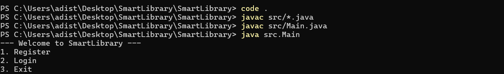
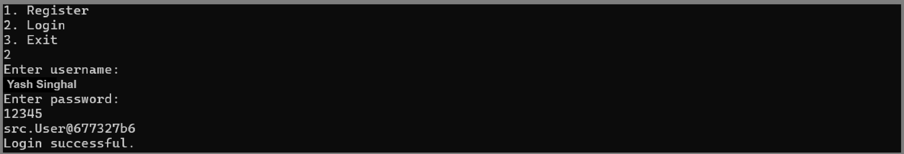
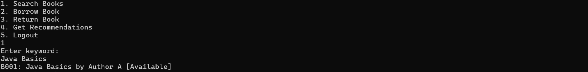
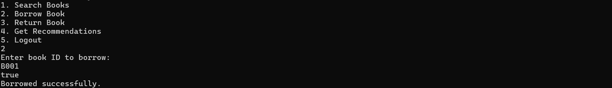
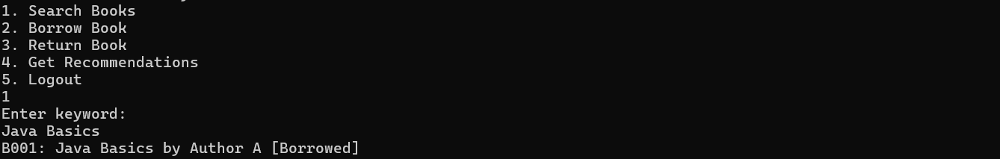
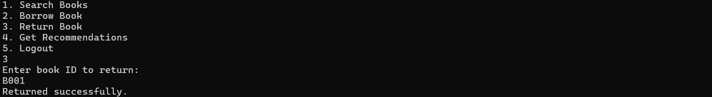
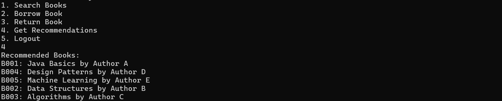
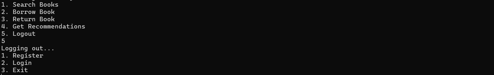

# 📚 SmartLibrary - Digital Library Management System

  

## 📖 Overview
**SmartLibrary** is a robust, CLI-based Library Management System designed to address the inefficiency of manual book tracking. Built as part of the "Build Your Own Project" initiative, this application demonstrates core **Object-Oriented Programming (OOP)** principles, file handling, and algorithmic logic in a real-world context.

It provides a seamless interface for students and educators to manage library resources while incorporating a **Recommendation Engine** that suggests books based on availability and user history.

## ✨ Key Features
Per the project functional requirements, the system is divided into logical modules:

### 👤 User Management Module
* **Registration & Authentication:** Secure login system using persistent user data.
* **Role-Based Access:** Tailored workflows for different user sessions.

### 📚 Library Operations Module
* **Catalog Search:** Efficient keyword-based search for book titles and authors.
* **Borrow/Return Cycle:** Real-time updates to book availability status.
* **Inventory Management:** Automated tracking of borrowed resources.

### 🧠 Intelligence Module
* **Smart Recommendations:** A recommendation engine that suggests available titles to users based on reading patterns and library inventory.

## 🛠️ Technologies Used
* **Language:** Java (JDK 8+)
* **Data Storage:** CSV (Comma Separated Values) for persistent data storage without an external database.
* **Tools:** Git (Version Control), VS Code/IntelliJ (IDE).
* **Concepts:** OOP (Encapsulation, Polymorphism), File I/O, Collections Framework, Exception Handling.

## 🚀 Installation & Execution
Follow these steps to set up the project locally.

**Prerequisites:** Ensure you have Java installed (`java -version`).

1.  **Clone the Repository**
    ```bash
    git clone [https://github.com/VITianYash42/SmartLibrary.git](https://github.com/VITianYash42/SmartLibrary.git)
    cd SmartLibrary
    ```

2.  **Compile the Project**
    *Note: Run this command from the root directory (outside `src`).*
    ```bash
    javac src/*.java
    ```

3.  **Run the Application**
    ```bash
    java src.Main
    ```

## 🧪 Testing
The project includes unit tests to validate core logic.
* **Run Tests:** Execute the JUnit runner (if configured) or manually verify workflows via the CLI menu.
* **Test Data:** Sample data is provided in `data_books.csv` and `data_users.csv`.

## 📸 Visual Walkthrough

### 1. Installation & Execution
*Compiling and running the application from the root directory.*


### 2. User Authentication
*The application starts with a secure Main Menu. Users can register or login.*


*Successful login redirects the user to the dashboard.*


### 3. Library Operations
**Searching for Books:**
*Users can search by keyword. Here, "Java Basics" is found and is currently [Available].*


**Borrowing a Book:**
*Selecting a book ID updates the inventory status instantly.*


**Real-time Status Update:**
*Searching for the same book again now shows it as [Borrowed], preventing double booking.*


**Returning a Book:**
*Returning the book makes it available for others again.*


### 4. Smart Features
**Recommendation Engine:**
*The system intelligently suggests books based on availability and user history.*


### 5. Session Management
*Secure logout functionality returns the user to the main menu.*

